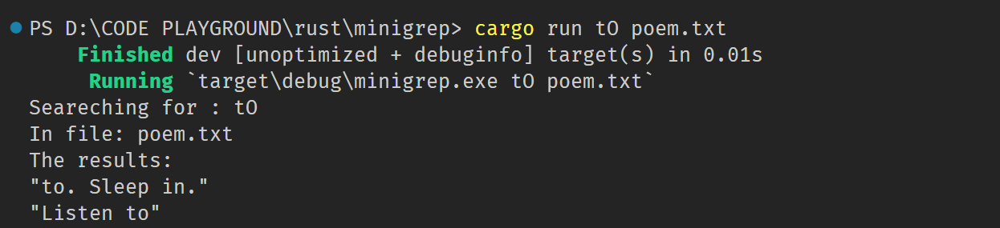

# MINIGREP CLI

* This is a imitation of grep function using rust
* All basic rust concepts are utilised

## How it runs

* Syntax is cargo run word file
* This syntax is splitted into query & filename

